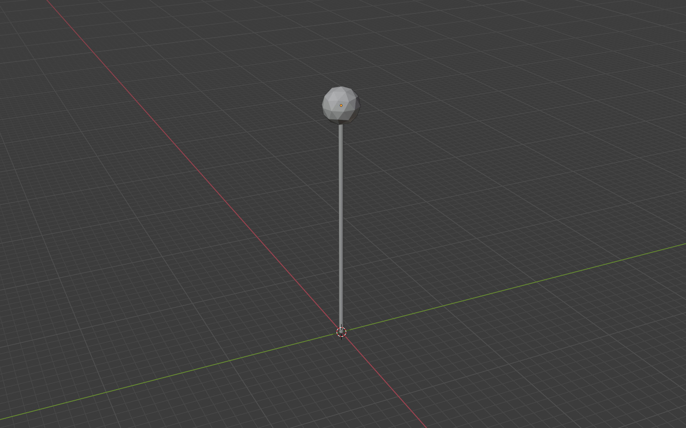
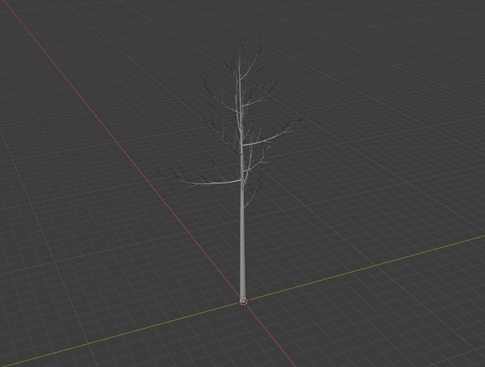
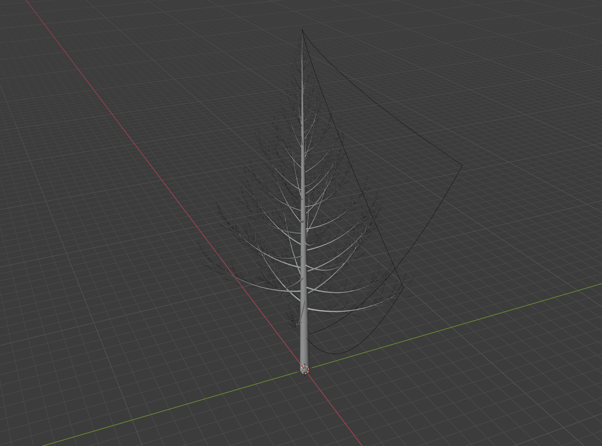

<!-- README.md is generated from README.Rmd. Please edit that file -->

```{r, include = FALSE}
knitr::opts_chunk$set(
  collapse = TRUE,
  comment = "#>",
  fig.path = "man/figures/README-",
  out.width = "100%"
)
```

# forthetrees: See the Forest (Using 3D Renders in Blender)

<!-- badges: start -->

[](https://choosealicense.com/licenses/mit/)
[](https://CRAN.R-project.org/package=forthetrees)
[](https://www.tidyverse.org/lifecycle/#experimental)
[](https://www.repostatus.org/#wip)
[](https://codecov.io/gh/mikemahoney218/forthetrees) 
[](https://github.com/mikemahoney218/forthetrees/actions)

<!-- badges: end -->


The goal of forthetrees is to help visualize forest landscapes by using 
user-provided data to produce detailed 3D renders of tree communities, using
the Blender 3D rendering software.

Please note that this package is in early development; breaking changes can and
will happen as better approaches become evident. 

## Usage

A long-term target of `forthetrees` is to build helper functions to transform 
standard plot inventory data into realistic simulations of forest communities 
(both within and between the sampled plots). At the moment, `forthetrees` 
provides "exporter" functions that will help to render trees; however, 
functions to scaffold preprocessing your data are still in development.

As a result, the current version of `forthetrees` requires users to interface a
little more directly with the [mvdf](https://mikemahoney218.github.io/mvdf/)
package to specify tree locations in an x/y/z grid. For instance, let's say we
have a single tree at the origin of our grid ([0, 0, 0]). We can represent that
tree as an `mvdf_obj`:

```{r}
library(forthetrees)
library(mvdf)
library(magrittr)
tree_loc <- data.frame(
  x = 0,
  y = 0,
  z = 0
) %>% 
  mvdf::mvdf_obj()
tree_loc
```

This object only contains the bare minimum amount of information needed to place
our trees in a scene, but that's okay -- our rendering functions are going to 
fill in all their other parameters with default values.

For instance, if we want to use the `ftt_add_cakepop` function to create little
push-pin "trees", we'd use the following block of code:

```{r eval = FALSE}
create_blender_frontmatter() %>% 
  ftt_add_cakepop(tree_loc) %>% 
  add_blender_endmatter("tmp.blend") %>% 
  execute_render()
```

Which creates a scene that looks like this:

```{r echo=FALSE}

```

If we wanted more realistic tree shapes, we'd swap out `ftt_add_cakepop` for 
`ftt_add_sapling`, keeping the rest of our code the same:

```{r eval=FALSE}
create_blender_frontmatter() %>% 
  ftt_add_sapling(tree_loc) %>% 
  add_blender_endmatter("tmp.blend") %>% 
  execute_render()
```

And get back a scene that looks more like this:

```{r echo=FALSE}

```

In order to start more heavily customizing our scenes, we need to provide a bit
more information to our rendering functions! While the functions do have the 
ability to handle parameters as arguments, `forthetrees` is designed to have you
specify values when you create your objects. For instance, to grow a different 
species of sapling we could create an `ftt_treespp` object:

```{r}
tree_loc <- data.frame(
  x = 0,
  y = 0,
  z = 0,
  id_key = "balsam fir", # capitalization doesn't matter
  id_code = "common_name"
) %>% 
  ftt_treespp()

tree_loc
```

Running the exact same code as earlier now plants a conifer in place of our 
default tree:

```{r eval = FALSE}
create_blender_frontmatter() %>% 
  ftt_add_sapling(tree_loc) %>% 
  add_blender_endmatter("tmp.blend") %>% 
  execute_render()
```

```{r echo=FALSE}

```

There are plenty of other knobs to fiddle, ranging from tree size (height and 
DBH) and color in the current version of forthetrees to texture and growth form
in an upcoming release.

## Installation

If the CRAN badge above is green, you can install forthetrees with:

``` r
install.packages("forthetrees")
```

You can always install the development version of forthetrees from 
[GitHub](https://github.com/mikemahoney218/forthetrees) with:

``` r
# install.packages("devtools")
devtools::install_github("mikemahoney218/forthetrees")
```

You'll also need to install [Blender](https://www.blender.org/download/) 
separately. forthetrees is tested against the current release of Blender and
is not guaranteed to work with older versions; in particular, sapling 
generation has notable bugs in Blender < 2.92 and some basic operations may
fail with Blender < 2.80.

## Code of Conduct

Please note that this package is released with a [Contributor
Code of Conduct](https://ropensci.org/code-of-conduct/). 
By contributing to this project, you agree to abide by its terms.
